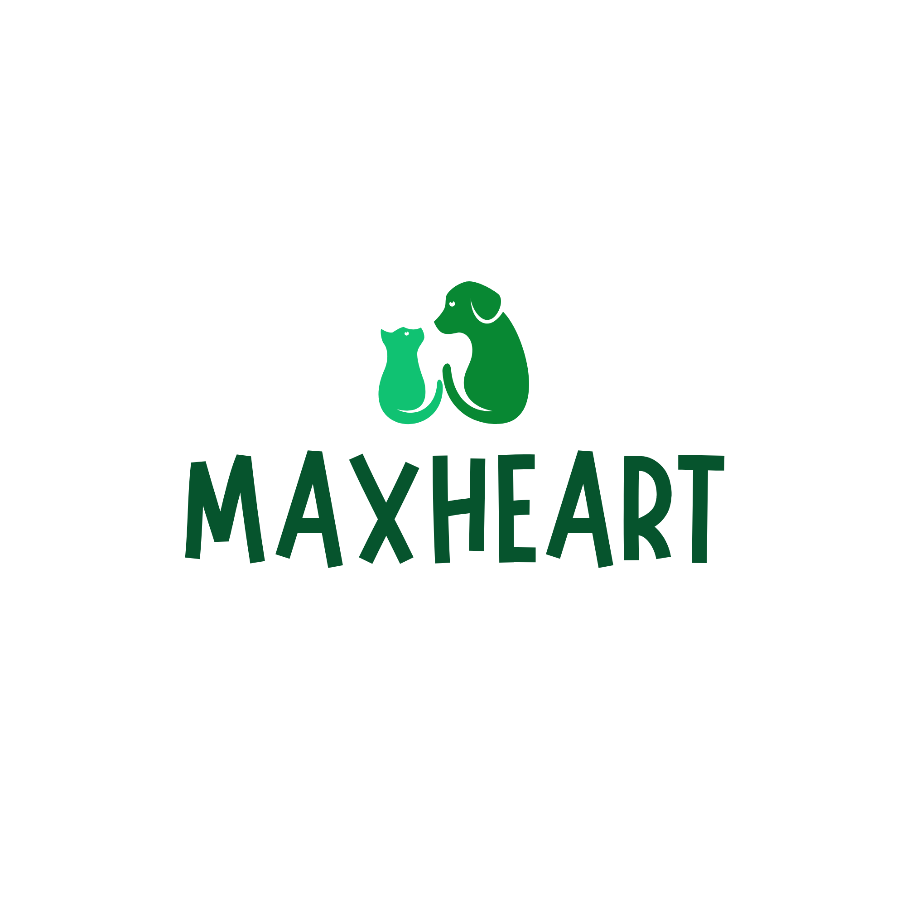

# Sistema de Gestión de PQRS "MaxHeart" - Universidad de Antioquia UdeA.

## 1. Persona a cargo del proyecto:
* **Nombre Completo:** Keyla Noguera Zambrano
* **Documento de identidad:** 1033728378
* **Docente:** John Heider Davila Davila
* **Programa Académico:** Ingeniería Industrial  
* **Facultad:** Facultad de Ingeniería  
* **Institución:** Universidad de Antioquia

## 2. Vínculos Académicos y Descripción
* **Perfil Profesional:** Estudiante de Ingeniería Industrial, orientada al análisis de procesos, optimización de recursos y diseño de flujos logísticos aplicados a la industria.  
* **Habilidades Destacadas:** Compromiso con mi proceso formativo, habilidades de autogestión y aprendizaje continuo, pensamiento analítico, adaptabilidad ante el cambio, capacidad de desarrollo de proyectos individuales y en equipo.  
* **Fortalezas para el Proyecto:** Compromiso autónomo e individual en cuanto al aprendizaje, desarrollo sistemático del software solicitado y resolución metódica de problemas estructurados mediante lógica computacional, a partir del compromiso de un desarrollo cognitivo adecuado, acompañado por las actividades de la materia.

## 3. Nombre del Proyecto y Detalles Corporativos
* **Nombre Oficial del Software:** MaxHeart  
* **Propósito General:** Crear un sistema digital estructurado que permita la gestión automatizada y el control de tiempos de Peticiones, Quejas, Reclamos y Sugerencias (PQRS), recibidas en la entidad, el cual se encuentra orientado hacia la optimización de los servicios de atención veterinaria de perros y gatos en la Universidad de Antioquia.
    
* **Identidad Corporativa:**  

## Actas de Entendimiento, Colaboración y Responsabilidad Individual

### Acta 1: Acta de Entendimiento Individual
* **Objetivo:** Desarrollar e implementar de manera individual el software "MaxHeart" para la gestión y optimización de PQRS de atención veterinaria en el campus de la Universidad de Antioquia, garantizando rigurosidad en el aprendizaje, gestión e implementación; flexibilidad en los procesos y compromiso en la gestión de las actividades referentes a los conocimientos adquiridos en el avance profesional de Ingeniería Industrial, en particular, de la materia para la cual se desarrolla dicha actividad.
* **Expectativas del Proyecto:** Consolidar un aprendizaje óptimo y autónomo de lógica algorítmica y programación en Python, entregando un producto de software que demuestre las habilidades adquiridas en el entorno de aprendizaje, que sea funcional y además pueda ser documentado, y que logre el objetivo de desarrollo de alto nivel que exige la formación en Ingeniería Industrial de la UdeA.

### Acta 2: Acta de Colaboración y Compromiso Personal
* **Metodología de Trabajo Autónomo:** La ejecución del proyecto es de forma 100% individual y autogestionada, estableciendo sesiones en tiempos diversos de desarrollo técnico y revisión de conocimientos, la primera parte del proyecto se lleva a cabo de manera pausada, debido a que se trata del primer acercamiento a la materia, lo que se vio impactado en los procesos de desarrollo, aunque se recibe apoyo digital, la convicción de adquirir un aprendizaje limpio y honesto, generó retrasos y actividades realizadas de manera lenta.
* **Canal y Frecuencia de Comunicación:** No se llevaron a cabo entrevistas con docentes o compañeros, fue autorizada la ejecución de manera individual, por tanto, el proyecto no tuvo uso de canales externos, aunque el docente deja las puertas abiertas para las tutorias, la lentitud de las actividades educativas propias no hizo posible la solicitud de dicho acompañamiento, por lo que la única estrategia se fijó en ayudas digitales; los tiempos y frecuencias para dedicar al desarrollo, son muy cambiantes, optando por espacios nocturnos e incluso dias enteros a la investigación. 
* **Mecanismo de Mitigación de Riesgos asociados al desarrollo del software:** En caso de retrasos técnicos y asociados al desarrollo de la actividad, se recurrirá de manera inmediata a la documentación para un análisis posterior, ya sea por tutorias, por investigación del material de apoyo o por mediación directa con el docente.

### Acta 3: Acta de Responsabilidad
* **Asignación de Tareas (100% a cargo de Keyla Noguera Zambrano):**
* **Realidad del proceso:** Las fases ejecutadas hasta la fecha fueron totalmente de conocimiento, como única responsable del proyecto, la asignacion de tiempos y actividades se regia por la evolución del aprendizaje, como antes se menciona, por ser lento el proceso cognitivo, la ejecución no se empezó a llevar a cabo hasta la última semana, cuando se considera que se empiezan a tener conceptos claros; sin embargo, a pesar de lo tardío, se estima que la comprensión de los pasos ejecutados son absolutamente permanentes y reales, puesto que, el enfoque siempre ha sido adquirir conocimientos apropiados.
* **Criterio de Evaluación Individual:** Cumplimiento con las directrices de aprendizaje real, estricto compromiso en cuanto a las investigaciones pertinentes para mejorar en el desarrollo profesional; las dificultades enfrentadas fueron notables motivaciones para no pasar por alto la importancia de anteponer el conocimiento, lo que se traduce en evolución y sobreposición personal.
* **Cierre fase 1. 18 septiembre (Entrega):** Se consolida la primera fase del proyecto, no se hacen revisiones ni tutorias por falta de tiempo, pero se investiga y acota información en línea, Tras jornadas intensas de trabajo autónomo, se consigue estructurar la identidad corporativa de MaxHeart y se logran sentar las bases estructurales del proyecto, basado en el aprendizaje en clases, dejando además, proyección del plan financiero y su cronograma. Finalmente, se hace la entrega por el respectivo medio del avance. 

* ## 4. Licencia del Software
Este software se registra bajo la licencia oficial **Creative Commons Atribución-NoComercial-CompartirIgual 4.0 Internacional (CC BY-NC-SA 4.0)**. Esta licencia protege la autoría intelectual individual del creador, permite a otros usuarios distribuir, remezclar, adaptar y ampliar el material en cualquier medio, pero prohíbe cualquier exportación con fines comerciales, además, obliga a que cualquier software derivado sea compartido bajo estos mismos términos de código abierto.

## 5. Reporte de Visión
* **Descripción General:** MaxHeart es una plataforma digital orientada a optimizar, rastrear y agilizar la recepción y resolución de Peticiones, Quejas, Reclamos y Sugerencias (PQRS) de los usuarios, cuya intención es apoyar la iniciativa de la atención de perros y gatos en el campus universitario. El proyecto se documenta desde la estructura inicial de planeación en Markdown para el sistema en mención.
* **Objetivo del software y Enfoque Animalista:** En lineación con la vocación social, el bienestar animal y la promulgación de proyectos de alto valor profesional que fomenta la institución, el software busca erradicar el procesamiento de información tardía e ineficiente a papel y lápiz; logrando sistematizar los flujos de datos, reduciendo los tiempos de respuesta operativos, garantizando un control riguroso y una canalización inmediata de los recursos asistenciales que benefician a los perros y gatos en condiciones de vulnerabilidad dentro del campus.
* **Beneficios Principales:** 
  * Disminución de los errores humanos al obtener la información directamente de los usuarios y así se reduce el riesgo de la duplicidad en el registro de radicados, gracias al apoyo sistematizado.
  * Permite el control estricto del ciclo de vida y estado de las PQRS en tiempo real, lo que facilita la toma de decisiones y las acciones a tiempo.
  * Posibilita la generación de alertas predictivas sobre documentos próximos a vencer, pudiendo fijarse en un límite  máximo de 30 días calendario, lo que mejora la gestión.

## 6. Especificación de Requisitos (Según las condiciones del Gestor de PQRS)
* **Requisitos Funcionales (RF):**
  * **RF1 - Validación Institucional:** El sistema debe ser capaz de restringir el ingreso del correo del solicitante, validando mediante operaciones de cadena, la existencia de único símbolo `@` y que todos pertenezcan estrictamente al dominio `@udea.edu.co`, esto con la intención de garantizar la recepcion de información real y salvaguardar un filtro que conlleve a los implicados directos, sin perdidas de tiempo.
  * **RF2 - Consecutivo Único de Radicación:** El sistema debe generar y asignar un número de radicado incremental, único, inalterable y secuencial por cada PQRS registrada de forma persistente, esto garantiza orden, control verdadero y la posibilidad de atender los casos en el orden apropiado.
  * **RF3 - Tipificación Obligatoria de Especie:** El sistema debe cumplir con el estandar inalterable de poder obligar a clasificar y limitar cada registro, asociando los datos del paciente exclusivamente a las categorías válidas: "perro" o "gato"; logrando de esta manera, la organización de datos de manera eficiente, pues se evitan desperdicios, al intentar hacer clasificaciones por apodos adicionales.
  * **RF4 - Control Automático de Tiempos Extremos:** El diseño del sistema debe calcular la fecha límite de respuesta, sumando con exactitud 30 días calendario a partir de la fecha de radicación inicial, facilitando asi, la reacción apropiada ante los casos, en un tiempo limite y disminuyendo el error por retrasos.
* **Requisitos No Funcionales (RNF):**
  * **RNF1 - Almacenamiento Estructurado e Independiente:** El sistema debe poder aislar y guardar los datos de forma persistente y consecuente en 4 archivos de texto planos independientes (`Peticion.txt`, `Queja.txt`, `Reclamo.txt`, `Sugerencia.txt`), asi se consigue un almacenamiento seguro y organizado dentro de la carpeta `/data`.
  * **RNF2 - Entorno Operacional:** El entorno de ejecución certificado y mandatorio será Google Colab, lo que asegura portabilidad completa en la nube, eludiendo procesos adicionales de instalación, es asi como se esquivan dependencias e instalaciones locales, que figuren como gastos en las memorias de los equipos internos.

## 7. Plan de Proyecto (Cronograma de Gantt y Presupuesto Profesional)
* **Cronograma por Semanas (Proyectado a 16 Semana del semestre presente):**
  * **Semanas 1-4:** Se realizó el análisis de las necesidades institucionales, proyecto de aprendizaje, adopción de conceptos y recolección de variables que permitirian de manera óptima la ejecución del proceso planeado.
  * **Semanas 5-8 (Fase Actual):** Implementación textual, definición y noción de las primeras variables, que permiten dar inicio a un panorama real de la problematica existente; se realiza la estructuración de especificaciones en GitHub Markdown, se implementa el diseño de la identidad de marca MaxHeart y se realiza la primera entrega de planeación escrita como fuente de evaluación para mejoras y reestructuraciones posteriores.
  * **Semanas 9-12:** Se espera dar inicio a la programación modular en Python, además, se estima una aproximación que facilite la  validación de cadenas de texto, que pueda garantizar un manejo seguro de los archivos de texto planos que se requieran en la implementación del software.
  * **Semanas 13-15:** Para tales instantes, se planea el proceso de codificación del motor lógico, los cuales posibilitaran los diversos cálculos requeridos y el ordenamiento secuencial de los estados de PQRS, adicional se espera que la estructura visual del software ya empiece a ser mas realista.
  * **Semana 16:** Implementación, analisis y revisión de las diversas pruebas de escritorio, documentación del manual de usuario, revisión final por parte del instructor y sustentación final individual.
* **Presupuesto Basado en la Ley de Prácticas colombiana (1 SMLV):**
  * Considerando los estandares del Departamento de Ingeniería Industrial para el desarrollo de proyectos autónomos de software, se estima según la ley de Colombia un total de **50 horas de trabajo autónomo** las cuales estaran distribuidas a lo largo del semestre presente; en cuanto al presupuesto salarial, se toma como base un Salario Mínimo Mensual Legal Vigente (SMMLV) en el año 2026, partiendo desde la perspectiva de un formato de prácticas técnicas, la remuneración se sitúa en $1.300.000 COP por un mes completo de labor, lo que equivale normalmente a 160 horas de trabajo, desde aqui, se sabe que el costo por hora equivale a **$8.125 COP**, por lo tanto, el presupuesto de inversión de mano de obra para MaxHeart se fija exactamente en: **$406.250 COP**.
 
    
### Representación Gráfica del Cronograma (Diagrama de Gantt)

| Fase / Actividad Operativa del Proyecto MaxHeart | S1 - S4 | S5 - S8 | S9 - S12 | S13 - S15 | S16 |
| :--- | :---: | :---: | :---: | :---: | :---: |
| **Fase 1:** Análisis, adopción de conceptos y recolección de variables | ■■■■ | | | | |
| **Fase 2 (Actual):** Implementación textual, marca y entrega escrita | | ■■■■ | | | |
| **Fase 3:** Programación modular en Python y validación de archivos planos | | | ■■■■ | | |
| **Fase 4:** Codificación del motor lógico y ordenamiento de PQRS | | | | ■■■■ | |
| **Fase 5:** Pruebas de escritorio, manual de usuario y sustentación | | | | | ■■■■ |

